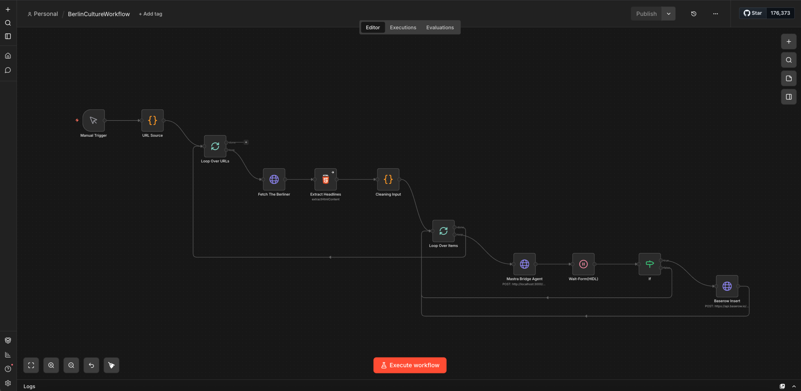
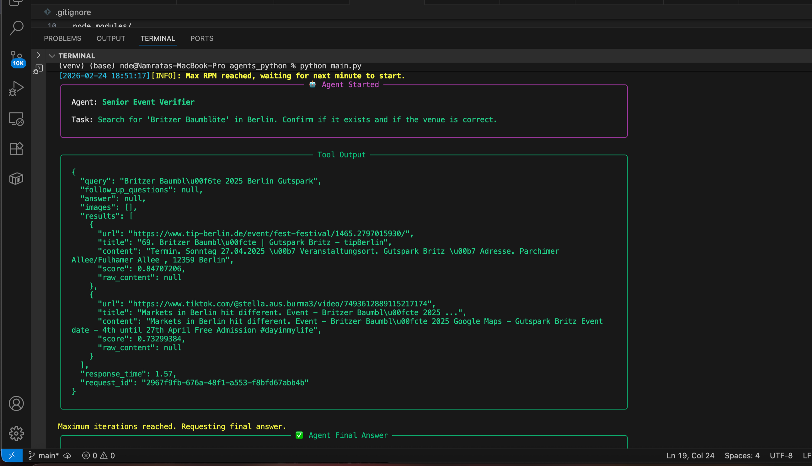
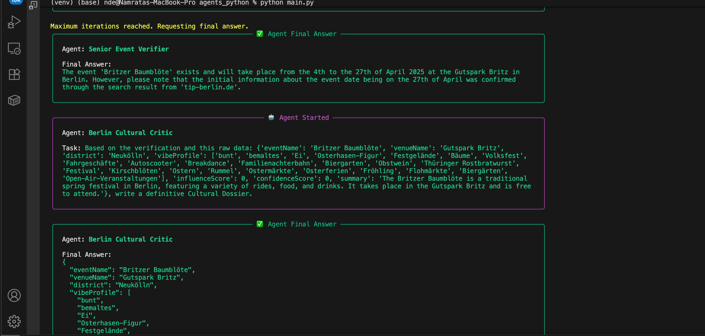
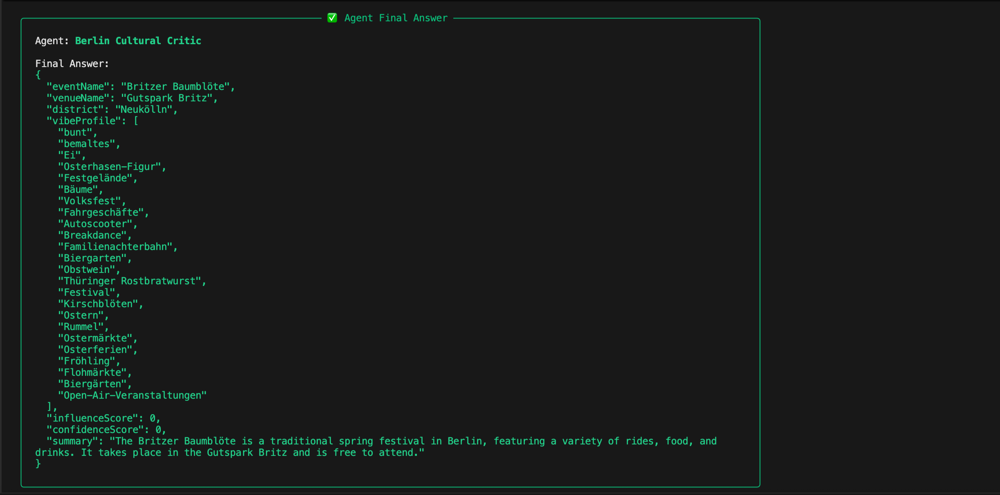
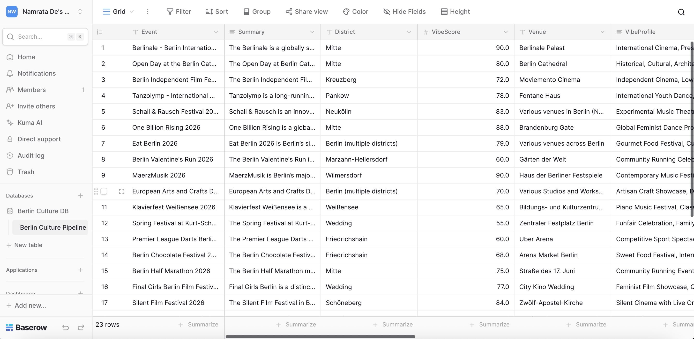
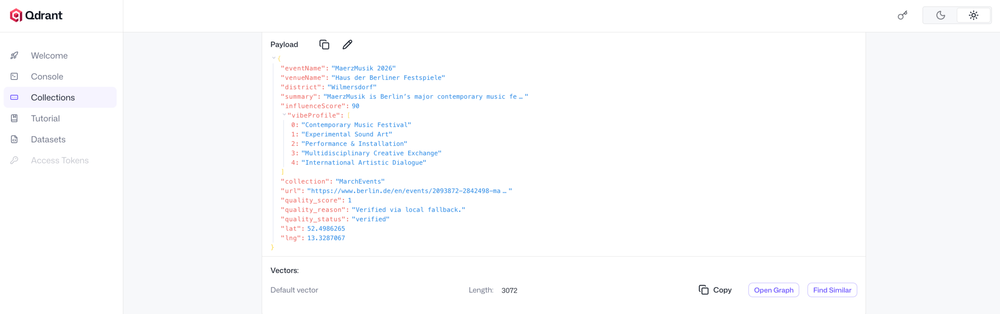
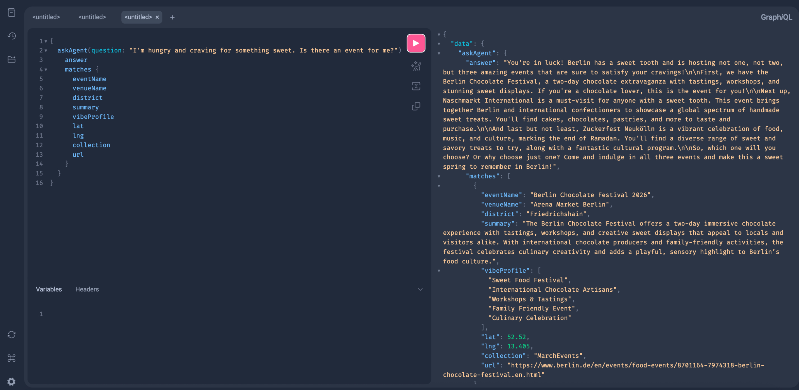
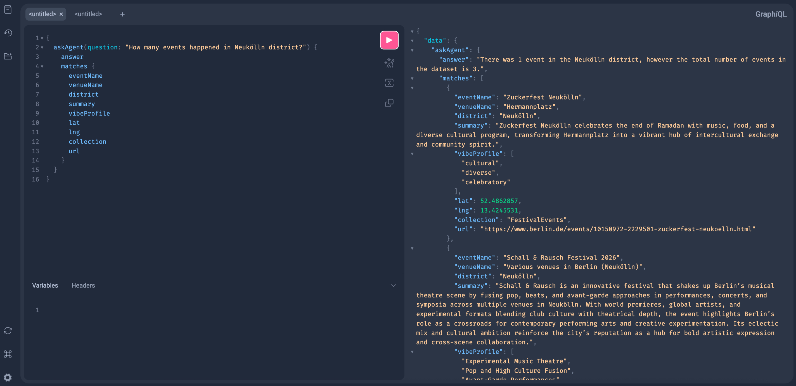
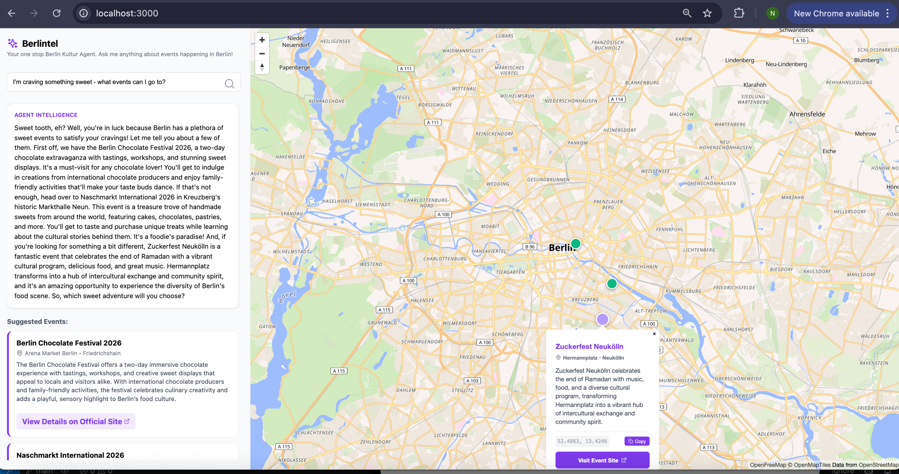

# 🎭 Berlintel Kultur: Agentic RAG & Event Intelligence

**A Multi-Agent Orchestration System for Cultural Intelligence**

Berlin Kultur Intel is a sophisticated, multi-language (Python/TypeScript) AI pipeline that automates the discovery, verification, and enrichment of Berlin's cultural events. It leverages a **Hybrid RAG** approach, combining **Semantic Vector Search** with **Text2SQL** to provide a high-precision discovery engine.

---

## How it Works: 

### The "Intelligence" Loop

We achieve high-fidelity cultural reporting through a four-stage **"Data Refinery"** process:


1.  **Scouting (The Signal):** Specialized **TypeScript (Mastra)** agents act as "digital scouts," monitoring web sources and event pages to ingest raw data in real-time.
2.  **Validation (The Gatekeeper):** Discovered events are handed off to a **Python (LangGraph/CrewAI)** layer. The system performs an automated "Double-Check" using web search tools to verify event existence and status.
3.  **Refinement (The Auditor):** Data is processed through a **DeepEval (LLM-as-a-Judge)** framework. It audits the content for hallucinations and ensures the "vibe profile" accurately reflects the source description.
4.  **Governance (The Human Touch):** To ensure total reliability, we implement **Human-in-the-Loop (HITL)**. High-impact events or low-confidence entries are held for manual approval via **n8n**, ensuring the final database is well curated.


### Smart Discovery

Once the data is "vaulted" in our hybrid storage system, users interact with the city's pulse through two intelligent modalities:

#### Semantic Search
Moving beyond rigid keywords, users can search by **"vibe," mood, or atmosphere** (e.g., *"Experimental jazz in a cozy setting"* or *"Industrial techno in an underground venue"*). Our **Qdrant** vector store handles the heavy lifting of matching natural language intent to event characteristics.


#### Analytical Intelligence (Text2SQL)
The platform acts as a cultural historian. By leveraging **Text2SQL**, users can ask complex analytical questions about the city's timeline (e.g., *"How many art festivals happened in Mitte March?"*). The system dynamically generates and executes SQL queries against our **SQLite** archive to provide precise, data-driven answers.

---

## The Technical Architecture

This project demonstrates proficiency across the following modern AI engineering lifecycle:

* **Multi-Agent Orchestration:**
  * **LangGraph:** Acts as the "Brain" for conditional routing and state management.
  * **CrewAI:** Orchestrates specialized Python agents for deep research and dossier polishing.
  * **Mastra:** Handles the TypeScript agent layer for high-performance scraping and signal processing.
  * **A2A (Agent-to-Agent):** Orchestrates hand-offs between TS and Python agents via cross-service communication.

* **LLM Infrastructure:**
  * **LiteLLM:** A unified gateway managing load balancing and fallbacks across **Gemini, Groq (Llama 3), Cerebras, Openrouter and SambaNova**.
  * **Text2SQL:** Dynamic translation of natural language into **SQLite** queries, enabling users to perform complex historical analytics (e.g., *"How many events happened in February?"*) without knowing SQL.
  * **PydanticAI:** Utilized for rigorous type-safe structured data extraction.

* **Data Strategy & Storage:**
  * **Qdrant:** High-speed Vector Database used for **Semantic Search** and **RAG**-based event discovery.
  * **SQLite:** Relational storage for the historical event archive, synced directly from the vector store for analytical querying.
  * **n8n:** Low-code automation for **A2A (Agent-to-Agent)** communication and **Baserow** syncing.

* **Reliability & Evaluation:**
  * **DeepEval:** Implements **LLM-as-a-Judge** to audit every dossier for faithfulness and hallucinations.
  * **HIDL / HITL (Human-In-The-Loop):**  The pipeline implements a strategic **Gatekeeper Pattern** via an n8n *'Wait-Form'* Node.

    * A human administrator receives a notification to review the dossier via a custom form.

    * Only upon manual approval is the record committed to the Qdrant Vector Store and Baserow table.

* **Interface Layer (AG-UI):**
  * **GraphQL (Strawberry):** Used for efficient, typed data fetching on the frontend, allowing for complex nested queries of event data.
  * **REST (FastAPI):** High-performance API layer providing the backbone for tool communication and internal service triggers.
  * **Uvicorn:** The lightning-fast ASGI server implementation used to serve the FastAPI and Strawberry applications.
  * **React + MapLibre:** A modern, spatial Agentic User Interface (AG-UI) that visualizes agentic outputs on a real-time interactive map of Berlin.

---

## Step-by-Step Deployment Guide


### 1. Initial Setup
```bash
git clone https://github.com/namratade97/berlin-kultur-intel.git
cd berlin-kultur-intel
python -m venv venv
source venv/bin/activate  # On Windows: venv\Scripts\activate
pip install -r requirements.txt
cd frontend && npm install
cd ../my-mastra-app && npm install
```
Also recommended to create a `.env` file declaring the API keys.

```
GROQ_API_KEY=xxx
GOOGLE_API_KEY=xxx
OPENROUTER_API_KEY=xxx
CEREBRAS_API_KEY=xxx
SAMBANOVA_API_KEY=xxx
OPENAI_API_KEY=xxx
BASEROW_TOKEN=xxx
TAVILY_API_KEY=xxx

```


### 2. Infrastructure Initialization

Start the core databases. This ensures **Qdrant (Vector DB)** are ready for the pipeline. Run this command from project's root folder:

```
docker-compose up -d
```

### 3. LLM Proxy Gateway
Start **LiteLLM** to manage our multi-model fallbacks. This allows the system to switch providers if one hits a rate limit.

```
python -m dotenv run -- litellm --config litellm_config.yaml --port 4000 --drop_params
```
### 4. Agentic Validation Engine

Launch the Python Backend. This server hosts the **LangGraph** workflow and **CrewAI** specialists that perform fact checking and polishing content. This also evaluates the validity the generated content with **DeepEval**.

```
cd agents_python && python main.py
```
### 5. Mastra Signal Processor
Now bring the TypeScript Scout Agent online. This agent is optimized for scraping and parsing raw cultural data from the web.

```
cd my_mastra_app && npx tsx src/server.ts
```

### 6. Data Pipeline (n8n)
Start n8n to run the orchestration workflow.

```
npm install -g n8n --legacy-peer-deps
```
followed by

```
n8n start
```
Once commands from Step 3-6 are running parallely on four different terminals, at `http://localhost:5678/` the n8n workflow editor should open up.

### 7. Import Workflow for n8n: 

Copy the contents of `n8n/BerlinCultureWorkflow.json` and paste it onto the n8n workspace. It should replicate the following workflow. This workflow acts as the A2A (Agent-to-Agent) bridge, and pushes agent's final response to a [Baserow](https://baserow.io/) table and Qdrant.

**Note:** At 'Wait-Form' node we incorporate a **Human-in-the-loop (HIDL)** strategy, where a form pops up with the agent's answer, and only if approved by the user, that information is stored in our databases. Else we go the next loop element.  
**Note:** At node "URL Source" three sample websites are provided - which can be modified accordingly.



Execute the workflow to get it started.





### 8. Post-Processing & Geofixing

We also have a script to import any Baserow table in our Qdrant database.
Run
```
python baserow/sync_baserow_to_qdrant.py
```
**Note:** A sample Baserow table for our schema can be found at `baserow/export - Berlin Culture Pipeline - Grid.json`




We also use the following command to update Qdrant points with latitude and longitude of the event venue, with the help of **Nominatim**.

```
python backend/geofix.py
```



Once our data is prepared, we move to the following steps:

### 9. GraphQL Backend

Host the Strawberry GraphQL playground on port 8000 with the following command:

```
python backend/main.py
```

When this service starts, it initializes a hybrid retrieval and analytics layer by syncing structured event metadata from **Qdrant (vector vault)** into a **SQLite archive** for historical querying. The /graphql endpoint exposes two core capabilities: **semantic search** via **embedding-based vector retrieval** and an **agentic question-answering pipeline**. Incoming queries are first embedded using Gemini embeddings and matched against Qdrant; depending on detected intent, the system dynamically routes the request either through a **RAG generation path (context-grounded answer synthesis)** or a **Text2SQL analytical path (LLM-generated SQLite queries over historical data)**. All generation requests pass through a **LiteLLM** fallback chain across multiple providers, ensuring resilience against rate limits while maintaining low-latency responses for the React frontend.





### 10. Launch the Map

With `backend/main.py` running, from another terminal launch the **React** frontend.
```
cd frontend && npm start 
```

Once launched, users can type their queries into the sidebar search area and see Agent's answer with relevant matches pulled from our database. The relevant locations are also pointed on the map with interactive pins.

